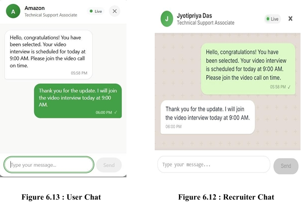

<div align="center">

# 💼 KaajKhojo

### Smart Job Portal & Recruitment Platform


A modern **MERN Stack Recruitment Platform** that connects **job seekers**, **recruiters**, and **administrators** through secure authentication, real-time messaging, video interviews, and intelligent job management.

</div>

---

# 📑 Table of Contents

- Overview
- Project Motivation
- Objectives
- Features
- User Roles
- Tech Stack
- System Architecture
- Folder Structure
- Installation
- Environment Variables
- Running Locally
- Authentication & Security
- Real-Time Communication
- API Modules
- Performance Optimizations
- Challenges
- Future Enhancements
- Screenshots
- Team Members
- Contributing
- License

---

# 🚀 Overview

KaajKhojo is a full-stack recruitment platform developed using the **MERN Stack** to simplify and modernize the hiring process. The platform enables recruiters to post job openings, manage applications, and conduct interviews, while job seekers can create professional profiles, apply for jobs, and communicate directly with recruiters.

The application integrates **Socket.IO** for real-time messaging and **WebRTC** for browser-based video interviews, creating a seamless recruitment experience.

---

# 💡 Project Motivation

Traditional job portals often suffer from delayed communication, disconnected interview workflows, and limited recruiter–candidate interaction.

KaajKhojo addresses these challenges by providing:

- Real-time communication
- Integrated video interviews
- Secure authentication
- Centralized job management
- Role-based dashboards
- Scalable cloud-ready architecture

---

# 🎯 Objectives

- Build a centralized recruitment platform
- Improve recruiter and candidate communication
- Enable secure authentication and authorization
- Provide responsive and scalable architecture
- Reduce hiring turnaround time
- Enhance user experience with modern technologies

---

# ✨ Features

## 👤 Job Seeker

- User Registration & Login
- Profile Management
- Resume Upload
- Browse Jobs
- Search & Filter Jobs
- Apply for Jobs
- Application Tracking
- Real-Time Chat
- Video Interviews

---

## 🏢 Recruiter

- Recruiter Registration
- Company Profile Management
- Create Job Listings
- Edit/Delete Jobs
- View Applicants
- Shortlist Candidates
- Chat with Candidates
- Conduct Video Interviews

---

## 🛡 Admin

- Dashboard
- Manage Users
- Manage Recruiters
- Moderate Job Posts
- Manage Applications
- Platform Monitoring

---

# 💬 Real-Time Communication

The platform supports modern recruiter–candidate interaction through:

- Socket.IO Live Chat
- WebRTC Video Calling
- Secure Peer-to-Peer Communication
- Instant Notifications
- Chat Access After Application Approval

---

# 🛠 Technology Stack

| Category | Technologies |
|-----------|--------------|
| Frontend | React.js, HTML5, CSS3, JavaScript |
| Backend | Node.js, Express.js |
| Database | MongoDB Atlas, Mongoose |
| Authentication | JWT, Express Session |
| Real-Time | Socket.IO, WebRTC |
| File Upload | Multer |
| Email Service | Nodemailer |
| Cloud | MongoDB Atlas |
| Version Control | Git & GitHub |

---

# 🏗️ System Architecture

<p align="center">
  
</p>

KaajKhojo follows a modern **MERN Stack** architecture with **React.js** for the frontend, **Express.js** and **Node.js** for backend services, **MongoDB Atlas** as the cloud database, **Socket.IO** for real-time messaging, **WebRTC** for video interviews, and **JWT** for secure authentication and authorization.

---

# 📁 Project Structure

```text
KaajKhojo/

├── backend/
│   ├── controllers/
│   ├── middleware/
│   ├── models/
│   ├── routes/
│   ├── config/
│   ├── socket/
│   ├── uploads/
│   ├── server.js
│   └── .env
│
├── frontend/
│   ├── public/
│   ├── src/
│   │   ├── components/
│   │   ├── pages/
│   │   ├── hooks/
│   │   ├── services/
│   │   └── utils/
│   └── package.json
│
├── package.json
├── README.md
└── .gitignore
```

---

# ⚙ Installation

## Clone Repository

```bash
git clone https://github.com/jyoti1900/KaajKhojo.git

cd KaajKhojo
```

---

## Install Backend

```bash
cd backend

npm install
```

---

## Install Frontend

```bash
cd ../frontend

npm install
```

---

# 🔑 Environment Variables

Create a `.env` file inside the backend directory.

```env
# Server
PORT=8080
NODE_ENV=development

# Database
MONGO_URI=your_mongodb_connection_string

# Authentication
SESSION_SECRET=your_session_secret
JWT_SECRET=your_jwt_secret

# Admin
ADMIN_EMAIL=admin@kaajkhojo.com
ADMIN_PASSWORD=your_admin_password

# SMTP
EMAIL_HOST=smtp.gmail.com
EMAIL_PORT=587
EMAIL_USER=your_email@gmail.com
EMAIL_PASSWORD=your_app_password

# Google OAuth
GOOGLE_CLIENT_ID=your_google_client_id
GOOGLE_CLIENT_SECRET=your_google_client_secret

GOOGLE_SIGNUP_CALLBACK=http://localhost:8080/api/v1/auth/google/signup/callback
GOOGLE_LOGIN_CALLBACK=http://localhost:8080/api/v1/auth/google/login/callback

# Frontend
CLIENT_URL=http://localhost:3000
```

---

# ▶ Running Locally

### Backend

```bash
cd backend

npm start
```

---

### Frontend

```bash
cd frontend

npm start
```

Application runs at:

```
Frontend : http://localhost:3000

Backend : http://localhost:8080
```

---

# 🔐 Authentication & Security

- JWT Authentication
- Express Sessions
- Role-Based Authorization
- Protected API Routes
- Password Hashing
- Input Validation
- Secure File Uploads
- Environment Variable Protection

---

# 📦 API Modules

- Authentication
- Users
- Recruiters
- Jobs
- Applications
- Resume Upload
- Chat
- Video Interview
- Notifications
- Admin Dashboard

---

# ⚡ Performance Optimizations

- Modular MVC Architecture
- RESTful API Design
- MongoDB Query Optimization
- Efficient Socket Connection Handling
- Lazy Component Loading
- Optimized React Rendering
- Scalable Backend Structure

---

# 🧪 Experimental Results

- Improved recruiter response time using real-time messaging.
- Reduced dependency on third-party meeting platforms.
- Increased candidate engagement through integrated communication.
- Scalable architecture supporting multiple concurrent users.
- Simplified recruitment workflow with centralized management.

---

# 🚧 Challenges Faced

- Implementing peer-to-peer WebRTC communication.
- Synchronizing Socket.IO events across multiple users.
- Role-based route protection.
- Managing secure resume uploads.
- Integrating real-time communication with application workflows.

---

# 🚀 Future Enhancements

- AI Job Recommendation System
- Resume Parsing with AI
- Email Notifications
- Push Notifications
- Analytics Dashboard
- Interview Scheduling
- Online Coding Assessments
- Mobile Application (React Native)
- Docker & Kubernetes Deployment
- CI/CD Pipeline

---

# 📸 Application Screenshots

## 🏠 Landing Page

<p align="center">
  
</p>

---

## 🔐 Choice Login Page

<p align="center">
  
</p>

---

---

## 🔐 Login Page

<p align="center">
  
</p>

---

## 📝 Register Page

<p align="center">
  
</p>

---

## 👤 User Profile & Application Status

<p align="center">
  
</p>

---

## 💼 Job Listing

<p align="center">
  
</p>

---

## 💬 Real-Time Chat

<p align="center">
  
</p>

---

## 🎥 Video Interview

<p align="center">
  
</p>

---

## 📊 Recruiter Dashboard

<p align="center">
  
</p>

---

## 🏢 Recruiter Profile

<p align="center">
  
</p>

---

## 📈 Admin Dashboard

<p align="center">
  
</p>

---
---

# 👨‍💻 Development Team

| Team Member | Contribution |
|------------|-------------|
| **Jyotipriya Das** | Project Lead, Backend Development, API Design, Database Architecture |
| **Sayan Pal** | Frontend Development, Testing, Debugging |
| **Indrajit Sahu** | User & Recruiter Frontend Modules |
| **Hasanoor Zaman** | Admin Dashboard Development |

---

# 🤝 Contributing

Contributions are welcome!

1. Fork the repository

2. Create a feature branch

```bash
git checkout -b feature/new-feature
```

3. Commit your changes

```bash
git commit -m "Add new feature"
```

4. Push to GitHub

```bash
git push origin feature/new-feature
```

5. Open a Pull Request

---

# 📜 Conclusion

KaajKhojo demonstrates the development of a modern recruitment platform that combines secure authentication, intelligent job management, real-time communication, and browser-based video interviews into a unified ecosystem. Its modular architecture, scalable backend, and responsive frontend make it suitable for real-world recruitment workflows and future enterprise enhancements.

---

# 📄 License

This project is licensed under the **MIT License**.

---

<div align="center">

⭐ If you found this project useful, consider giving it a **Star** on GitHub!

</div>
